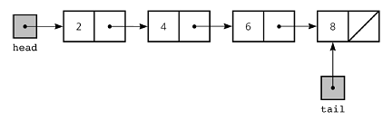

# Linked List

## Definition: 

- A linked list is a linear data structure wher each element is a seperate object. 
- Linked list elements are not stored at contigous location in memory; the element are linked pointers.

## Structure:

- Each node of a list is made up of two items - the data and a reference to the next node. The last node has a reference to null. The entry point into a linked list is called the head of the list. 
- It should be noted that the head is not a seperate node, but the reference to the first node. If the list is empty then the head is a null reference. 




## Implementation: 

- Each node in a list consist of at least two parts: 

```
1. Data
2. Pointer to the next node
```

- Example of linked list node with integer data intialization in Python
```
# Linked list example in Python
# Node class
class Node: 
    #Function to intialize the node object: 
    def __init__(self, v):
        self.val = v #assign value
        self.next = None #intialize next as nulll

#Linked List Class
class ListNode:
    #function to initialize the linked list: 
    def __init__(self):
    self.head = None
```
- Example of linked list node with integer data intialization in Java
```
// Linked list example in Java
// Linked list class
class ListNode
{
    // head of list
    Node head;
 
    // Node class
    class Node
    {
        int val;
        Node next;
          
        // Constructor to create a new node
        Node(int v) {
           val = v;
        }
    }
}

```

- Example of linked list node with integer data intialization in C/C++

```
// Linked list example in C/C++
// A linked list node
struct ListNode
{
  int val;
  struct ListNode *next;
};

```

## Doubly Linked List:

### Definition: 
- A doubly linked list is a data structure where a set of sequential links of records called node exists. Unlike singly linked list, a node of a doubly linked list consists of three fields: two link fields and one information field. 
- Two link field provide information about the address of the previous nodes and the next nodes in the sequence 
- One data field would show the value that a node stores. 

- The link fields are also known as “previous” and “next” pointers and store the addresses of the previous and next nodes in the list.
-  The previous pointer of the very first node, as well as the next pointer of the last node points to a Null value or called a sentinel node. 


Pseudocode: 
```
Struct Node:
    int data; 
    struct node *next *prev;
    *head;

```


